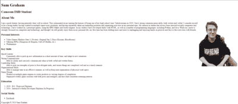
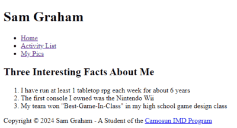
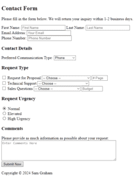
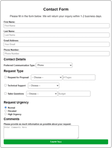
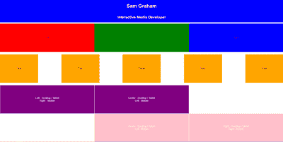

# WanderingMaw.github.io
<!DOCTYPE html>
<html lang="en">
	<head>
		<meta charset="utf-8">
		<meta name="viewport" content="width=device-width,initial-scale=1">
		<meta name="author" content="Sam Graham">
		<title>COMP 144 - Lab 06 ePortfolio - Sam Graham</title>
		<!-- allows use of Roboto google font -->
		<link rel="preconnect" href="https://fonts.googleapis.com">
		<link rel="preconnect" href="https://fonts.gstatic.com" crossorigin> 
		<link href="https://fonts.googleapis.com/css2?family=Roboto:ital,wght@0,100;0,300;0,400;0,500;0,700;0,900;1,100;1,300;1,400;1,500;1,700;1,900&display=swap" rel="stylesheet"> 
		<link rel="stylesheet" type="text/css" href="css/styles.css"> <!-- link to stylesheet -->
		 <!-- Allows use of Font Awesome Icons -->
	</head>

	<body>
		<!-- navbar -->
		<header id="top">
			<nav>
				<!-- My name, which links to the showcase section -->
				

					<h1><a href="#showcase">Sam Graham</a></h1>
					<label for="mobile-menu-trigger">Menu &#9776;</label>
				

				<!-- hidden checkbox to show/hide menu in mobile/tablet -->
				<input type="checkbox" id="mobile-menu-trigger">
				<!-- nav menu list -->
				<ul>
					<li><a href="#skills">Skills</a></li>
					<li><a href="#portfolio">Portfolio</a></li>
					<li><a href="#about">About</a></li>
					<li id="cv-nav"><a href="#cv">Curriculum Vitae</a></li>
					<li><a href="#contact">Contact</a></li>
				</ul>
			</nav>
		</header>
		
		<!-- Showcase section -->
		<section id="showcase">
			<h1>Sam Graham</h1>
			<h2>Interactive Media Development Student</h2>
			<a href="#skills">Tell Me More</a>
		</section>
			
		<!-- Skills section -->
		<section id="skills">
			<h2>Skills</h2>
			<h3>A growing skillset as I progress through my career</h3>
			

				<!-- Skill description for mobile-first web development, with Font Awesome mobile icon -->
				

					
						<i class="fa-solid fa-circle fa-stack-2x"></i>
						<i class="fa-solid fa-mobile-screen fa-stack-1x"></i>
					
					<h3>Mobile-First Web Development</h3>
					
Experience using HTML/CSS to develop web pages and sites with a focus on efficiency on mobile devices, while maintaining a strong UX/UI on desktop.

				

				<!-- Object-Oriented Programming with Font Awesome code-branch icon -->
				

					
						<i class="fa-solid fa-circle fa-stack-2x"></i>
						<i class="fa-solid fa-code-branch fa-stack-1x"></i>
					
					<h3>Programming</h3>
					
Foundational skills in object-oriented programming using Java, C# and Python for creation of database management programs. Additional experience in using Godot for video game development.

				

				<!-- User Centered mindset with Font Awesome brain icon -->
				

					
						<i class="fa-solid fa-circle fa-stack-2x"></i>
						<i class="fa-solid fa-brain fa-stack-1x"></i>
					
					<h3>User-Centered Mindset</h3>
					
Use of a user-centered mindset to ensure products and services are developed with the best user experience in mind, and experience collecting and incorporating user feedback.

				

			

		</section>
			
		<!-- Portfolio section -->
		<section id="portfolio">
			<h2>Portfolio</h2>
			<h3>Some web projects I have developed during my time in the Camosun IMD program</h3>
			

				<!-- Web Dev Lab02, "About Me" page -->
				

					
					<h3>"About Me" Page</h3>
					
A page developed using HTML to give a bit of background of myself, and display a foundational HTML understanding.

				

				<!-- Web Dev Lab03, Facts, Activities, Pics linking pages -->
				

					
					<h3>Facts, Activities, and Pics</h3>
					
A site developed to showcase skills in HTML linking, lists, and tables.

				

				<!-- Web Dev Lab04, Contact Form -->
				

					
					<h3>HTML Contact Form</h3>
					
A page developed to showcase skills with HTML forms and labels.

				

				<!-- Web Dev CSS practice, contact form -->
				

					
					<h3>HTML/CSS Contact Form</h3>
					
A continuation of the previous form, with added CSS to showcase foundational skills.

				

				<!-- Web Dev Lab05, Mobile-First flexboxes -->
				

					
					<h3>Mobile-First Flex Boxes</h3>
					
A page developed to display skill in mobile-first development with flex-boxes.

				

				<!-- Web Dev Lab07, Bootstrap ePortfolio (Coming Soon!) -->
				

					  <!-- Photo Credit: Photo by <a href="https://unsplash.com/@coltonsturgeon?utm_content=creditCopyText&utm_medium=referral&utm_source=unsplash">Colton Sturgeon</a> 
					on <a href="https://unsplash.com/photos/brown-and-white-lace-up-boot-cHxZmiziwMI?utm_content=creditCopyText&utm_medium=referral&utm_source=unsplash">Unsplash</a>-->
					<h3>Bootstrap: Coming Soon!</h3>
					
A version of this page developed using bootstrap framework, rather than custom CSS.

				

			

		</section>
			
		<!-- About Section -->
		<section id="about">
			<h2>About</h2>
			<h3>The journey of a young man fascinated by technology</h3>
			

				<!-- Day Care GameCube memories with GameCube image -->
				

					

						<h4>2004-2006</h4>
						<h4>The Daycare GameCube</h4>
						
The GameCube startup sound and animation is something extremely nostalgic to me. Some of my earliest memories include time spent playing on the GameCube at DayCare. 
						I attribute these memories to sparking the match that would light the fire of my passion for technology.

					

					

						 <!-- Photo by <a href="https://unsplash.com/@north_of_rapture?utm_content=creditCopyText&utm_medium=referral&utm_source=unsplash">Paweł Durczok</a> 
						on <a href="https://unsplash.com/photos/white-and-black-nintendo-gamecube-on-gray-surface-a4jQAuh7C30?utm_content=creditCopyText&utm_medium=referral&utm_source=unsplash">Unsplash</a> -->
					

				

				<!-- Early considerations of career & inspirations with Millenium Falcon hallway image -->
				

					

						<h4>2007-2014</h4>
						<h4>"What do you want to be when you grow up?"</h4>
						
That infamous question. For me, it was easy (or at least I thought it was). At this time, I was starting to explore things like sci-fi media, discovering things like Star Wars.
						I decided at that time that I wanted to be someone who could make all the awesome things I saw on TV.

					

					

						 <!-- Photo by <a href="https://unsplash.com/@karsten116?utm_content=creditCopyText&utm_medium=referral&utm_source=unsplash">Karsten Winegeart</a> 
						on <a href="https://unsplash.com/photos/a-hallway-in-a-sci-fi-style-building-with-a-door-leading-to-another-room-D28ZMeWdyFM?utm_content=creditCopyText&utm_medium=referral&utm_source=unsplash">Unsplash</a> -->
					

				

				<!-- Middle/high school career considerations with robot image -->
				

					

						<h4>2015-2020</h4>
						<h4>A Refined Vision</h4>
						
At this point I decided to take a step back and refine my goals a bit. I tried some robotics, but something just didn't click. I found the limitations
						of the physical aspects of it quite frustrating to work with at times. I still enjoyed programming though, so I decided I'd focus more on that.

					

					

						 <!-- Photo by <a href="https://unsplash.com/@rocknrollmonkey?utm_content=creditCopyText&utm_medium=referral&utm_source=unsplash">Rock'n Roll Monkey</a> 
						on <a href="https://unsplash.com/photos/blue-plastic-robot-toy-R4WCbazrD1g?utm_content=creditCopyText&utm_medium=referral&utm_source=unsplash">Unsplash</a> -->
					

				

				<!-- High school/graduated developments in interests and career with paintbrush image -->
				

					

						<h4>2018-2024</h4>
						<h4>Discovering Creativity</h4>
						
As I got older, I finally found the side of me that enjoyed some creativity. I discovered a passion for visual art, and storytelling. This narrowed down my goals for my career even further
						to wanting to make something that utilized that new creative side. Something interactive, maybe even fun. That eventually led me to the IMD program at Camosun.

					

					

						 <!-- Photo by <a href="https://unsplash.com/@rhondak?utm_content=creditCopyText&utm_medium=referral&utm_source=unsplash">RhondaK Native Florida Folk Artist</a> 
						on <a href="https://unsplash.com/photos/assorted-color-paintbrushes-_Yc7OtfFn-0?utm_content=creditCopyText&utm_medium=referral&utm_source=unsplash">Unsplash</a> -->
					

				

				<!-- "Your Next Hire" bubble -->
				

					

					

					

						<h4>Your Next Hire</h4>
					

				

			

		</section>
			
		<!-- Curriculum Vitae section -->
		<section id="cv">
			<h2>Curriculum Vitae</h2>
			<h3>Please see my CV below.</h3>
			

				<!-- Left/Top side of CV, for profile, contact info, lists of brief personal info -->
				

					<!-- Profile pic of me -->
					
					<h2>Sam Graham</h2>
					<!-- Contact Info -->
					<ul>
						<li>sgraham1254@gmail.com</li>
						<li>250-719-0829</li>
						<li>Victoria, BC</li>
					</ul>
					<!-- Font Awesome social media/email links -->
					<ul class="social-icons">
						<li>
							<a href="mailto:sgraham1254@gmail.com">
								
									<i class="fa-solid fa-circle fa-stack-2x"></i>
									<i class="fa-solid fa-envelope fa-stack-1x fa-inverse"></i>
								
							</a>
						</li>
						<li>
							<a href="https://www.instagram.com/the_wandering_maw/?hl=en">
								
									<i class="fa-solid fa-circle fa-stack-2x"></i>
									<i class="fa-brands fa-instagram fa-stack-1x fa-inverse"></i>
								
							</a>
						</li>
						<li>
							<a href="https://www.facebook.com/people/Sam-Graham/pfbid02cf1sPH36294WG5CHLuNFR3AHmuq4gzCMpc4Z3RRnS2nCFhuj422eTtdtpgByb7BXl/">
								
									<i class="fa-solid fa-circle fa-stack-2x"></i>
									<i class="fa-brands fa-facebook-f fa-stack-1x fa-inverse"></i>
								
							</a>
						</li>
					</ul>
					
					<h5>Technical Skills</h5>
					<ul>
						<li>HTML/CSS</li>
						<li>C#</li>
						<li>Python</li>
						<li>Java</li>
						<li>Adobe</li>
						<li>MS Office</li>
					</ul>
					
					<h5>Personal Interests</h5>
					<ul>
						<li>Video Games</li>
						<li>Reading</li>
						<li>Storytelling</li>
						<li>Miniature Painting</li>
						<li>Tabletop Games</li>
					</ul>
				

				
				<!-- Right/bottom side of CV, with more in depth bio, education, work experience -->
				

					<h3>Profile</h3>
					

						I am currently a student studying in the Camosun College Interactive Media Development program. I have been interested in computers, technology, and storytelling for my entire life. 
						My goal is to put my technical skill and passion towards creating great, memorable products.
					

					
					<h3>Education</h3>
					<dl>
						<dt>Current</dt>
						<dd>Camosun College</dd>
						<dd>Interactive Media Development</dd>
						
						<dt>September 2017 - June 2020</dt>
						<dd>Dawson Creek Secondary School</dd>
					</dl>
					
					<h3>Work Experience</h3>
					<dl>
						<dt>September 2017 - September 2021</dt>
						<dd>Key Holder & Shift Supervisor</dd>
						<dd>Dave's No Frills</dd>
						
						<dt>April 2022 - August 2022</dt>
						<dd>Concession Cashier/Server & Ticket Checker</dd>
						<dd>Westshore Cineplex</dd>
						
						<dt>August 2022 - October 2022</dt>
						<dd>Shift Supervisor</dd>
						<dd>Hillside Qoola</dd>
					</dl>
				

			

		</section>
			
		<!-- Contact section -->
		<section id="contact">
			<h2>Contact Me</h2>
			<h3>Fill out the forms below, and I will get back to you within 48 hours.</h3>
			<form class="container" action="https://144.compsci.cc/submit-form/" method="post">
				<!-- Top/left part of contact form, for messager's name and contact info -->
				

					<input type="text" id="contact-name" name="contact_name" placeholder="Your Name *" required>
					<input type="email" id="contact-email" name="contact_email" placeholder="Your Email *" required>
					<input type="tel" id="contact-phone" name="contact_phone" placeholder="Your Phone *" required>
				

				
				<!-- Bottom/right part of contact form, for message -->
				

					<textarea id="message" name="message" placeholder="Your Message *"></textarea>
				

				
				

					<button type="submit">Send Message</button>
				

			</form>
		</section>
		
		<!-- Footer section -->
		<footer>
			
Copyright &copy; 2024 Sam Graham

			
			<!-- Font Awesome social media links-->
			<ul class="social-icons">
				<li>
					<a href="mailto:sgraham1254@gmail.com">
						
							<i class="fa-solid fa-circle fa-stack-2x"></i>
							<i class="fa-solid fa-envelope fa-stack-1x fa-inverse"></i>
						
					</a>
				</li>
				<li>
					<a href="https://www.instagram.com/the_wandering_maw/?hl=en">
						
							<i class="fa-solid fa-circle fa-stack-2x"></i>
							<i class="fa-brands fa-instagram fa-stack-1x fa-inverse"></i>
						
					</a>
				</li>
				<li>
					<a href="https://www.facebook.com/people/Sam-Graham/pfbid02cf1sPH36294WG5CHLuNFR3AHmuq4gzCMpc4Z3RRnS2nCFhuj422eTtdtpgByb7BXl/">
						
							<i class="fa-solid fa-circle fa-stack-2x"></i>
							<i class="fa-brands fa-facebook-f fa-stack-1x fa-inverse"></i>
						
					</a>
				</li>
			</ul>
		</footer>
	</body>
	
</html>
<!-- Web Page Created By: Sam Graham -->
<!-- All photos (except for Portfolio Bootstrap image, and the About images) are taken/owned by me. Credit to my girlfriend for taking the showcase background/CV profile picture. -->
